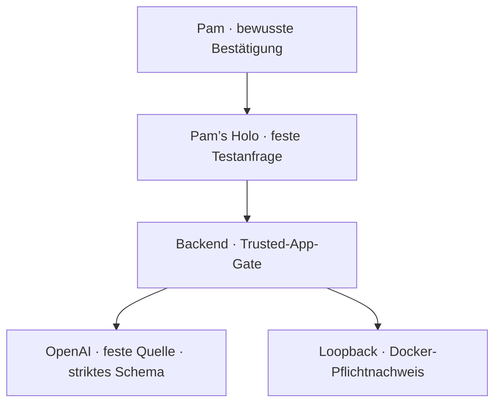

# Sol Holo × OpenClaw Lab

Stand: 06.09.2026
Status: **Phase 1 wird um Familie & Kinder sowie Senioren und hilfe-/pflegebedürftige Menschen erweitert; Docker-Verifikation der acht Worker ausstehend; Phase 2c und 2d bleiben standardmäßig ausgeschaltet und nicht produktiv**

OpenClaw `2026.9.1` läuft als getrenntes Labor. Acht Fach-Worker sind angelegt: Alltag, Familie & Kinder, Senioren und hilfe-/pflegebedürftige Menschen, Geschäftliches, Tiere, Kochen, Sicherheit und Medizin. Jeder Worker sieht ausschließlich das Werkzeug `read`, sein eigenes Workspace und klar markierte erfundene Testdaten.

Sol Holo beziehungsweise Pam's Holo bleibt Kopf, Persönlichkeit, Stimme und persönliches Gedächtnis. Die Worker sind begrenzte Ausführungsbereiche, keine eigenen Clone.

## Gemeinsames Grundgerüst

`foundation.manifest.json` ist die zentrale, maschinenlesbare Bereichsliste. Sie hält die acht Worker, ihre getrennten Workspaces und die unveränderlichen Phase-1-Grenzen fest. Unbekannte Bereiche werden nicht automatisch zugeordnet, und der Koordinator besitzt weder Werkzeuge noch automatische Routing-Freigabe.

Zwei JSON-Schemas legen die kontrollierte Übergabe fest:

- `contracts/task-envelope.schema.json`: nur ein ausdrücklich benannter Worker, synthetische Daten, relative Pfade, Fähigkeit `read`, Modus `proposal-only` und keine externe Aktion;
- `contracts/worker-result.schema.json`: Fakten, Unsicherheiten und Vorschlag getrennt; Schreiben, Grenzübertritt und externe Aktion müssen ausdrücklich `false` sein.

Die Phase-1-Beispiele unter `examples/` zeigen den vollständigen Vertrag am sensiblen Bereich Sicherheit. Sie sind ausschließlich Dokumentation und Testdaten, kein aktiver Router. Ein produktiver Adapter bleibt ausgeschaltet und benötigt einen eigenen Entwurf, eigene Tests und Pams ausdrückliche Bestätigung.

## Phase 2 – erster einzelner Alltag-Test

Nach Pams ausdrücklicher Freigabe wird genau eine fiktive Alltag-Aufgabe als Vorschau geprüft. `phase2/alltag-preview.manifest.json` begrenzt sie auf `worker-alltag`, `testdaten/alltag-fiktiv.md`, Fähigkeit `read` und ein Ergebnis ohne externe Aktion. `phase2/alltag-preview-gate.mjs` verlangt einen manuellen Einmal-Marker und den bewusst gesetzten, standardmäßig ausgeschalteten Schalter `OPENCLAW_LAB_ALLTAG_PREVIEW_ENABLED=1`.

Das Gate akzeptiert keine freie Texteingabe, keine echten Daten, keinen anderen Pfad, keinen anderen Worker und keine zweite Freigabe im selben Gate-Prozess.

Der [GitHub-Actions-Lauf #5](https://github.com/pamelanitschke75-cyber/Sol-Holo-/actions/runs/33966844004) bestätigte die Vorschau in der echten Docker-Sandbox: ein eigener Lesezugriff, ein strukturiertes Vorschauergebnis, keine externe Aktion, kein Schreiben, kein Bereichswechsel und weiterhin menschliche Prüfung. Alle bisherigen 18 Rechteprüfungen der sechs Worker blieben ebenfalls grün.

## Ergänzung – Familie, Kinder, Senioren und Pflege

Pam hatte Familie, Kinderbetreuung, Senioren und pflegebedürftige Menschen von
Anfang an als Bestandteil von Sol Holo festgelegt. Am 06.09.2026 wurde die
bislang unvollständige Worker-Aufteilung deshalb um zwei eigenständige,
besonders geschützte Bereiche ergänzt: `worker-familie-kinder` und
`worker-senioren-pflege`.

Kinder sowie Senioren und hilfe- oder pflegebedürftige Menschen besitzen im
Grundmanifest dieselbe höchste Schutzpriorität. Die neuen Worker respektieren
Kindeswohl, Würde, Selbstbestimmung, Einwilligung und Privatsphäre. Sie ersetzen
weder Betreuung noch Pflege oder Medizin, dürfen niemanden überwachen,
kontaktieren oder bevormunden und können keinen anderen Worker automatisch
aufrufen. Auch für sie gelten ausschließlich synthetische Daten, `read`,
schreibgeschützte Docker-Sandboxes, `network: none` und menschliche Prüfung.

## Phase 2b – sichtbare Testverbindung in Pam’s Holo

Pam’s Holo zeigt in den Verbindungen nun eine ausdrücklich als fiktiv bezeichnete Alltagsworker-Zeile. Erst ein bewusster Bestätigungsdialog und die gerätegebundene vertrauenswürdige App-Sitzung dürfen den fest eingebauten Testauftrag an `/openclaw/alltag-preview` senden. Der Client kann weder Freitext noch echte Daten in diesen Auftrag einsetzen.

Das Backend besitzt zwei voneinander unabhängige, standardmäßig ausgeschaltete Feature-Schalter. Sind beide bewusst aktiv, darf es ausschließlich einen authentifizierten Runner auf `127.0.0.1` oder `::1` unter dem festen Pfad `/v1/alltag-preview` ansprechen. Der Runner autorisiert den Auftrag erneut mit dem Einmal-Gate und startet genau `worker-alltag` in der bestehenden gehärteten Docker-Sandbox. Antworten werden größenbegrenzt und nochmals gegen den Ergebnisvertrag geprüft, bevor die App sie ausschließlich sichtbar darstellt.

`phase2/sol-holo-alltag-connection.manifest.json` beschreibt diese Verbindung maschinenlesbar. Der Quellstand ist absichtlich noch nicht produktiv aktiviert: Ohne beide Feature-Schalter, lokalen Runner und langes Bridge-Token lehnt der Server die Anfrage geschlossen ab. Kalender, Notes, Kontakte, Nachrichten, Geräte, Medizin, echte Alltagsdaten und automatische Weiterleitung bleiben außerhalb der Freigabe.

## Phase 2c – vorhandener OpenAI-Testweg

Als Alternative zu einer dauerhaft laufenden Docker-Bridge kann der bestehende Render-Dienst für genau denselben festen Fantasietest den bereits eingerichteten OpenAI-Zugang verwenden. Dieser Weg benötigt keinen neuen Anbieter, kein neues Konto und keinen zusätzlichen Server. Er wird ausschließlich gewählt, wenn `OPENCLAW_ALLTAG_PREVIEW_EXECUTOR=openai` sowie die beiden unabhängigen OpenAI-Vorschau-Schalter bewusst gesetzt sind. Eingecheckt ist keiner dieser Laufzeitwerte.

An OpenAI gehen nur die feste Frage und der Inhalt der eingecheckten Datei `testdaten/alltag-fiktiv.md`. Freitext aus der App, Owner-, Geräte- und Sitzungskennungen sowie Umgebungsgeheimnisse werden nicht aufgenommen. Die Anfrage besitzt keine Werkzeuge, setzt `store: false` und verlangt ein striktes JSON-Schema. Das Ergebnis durchläuft anschließend unverändert die bestehende zweite Worker-Vertragsprüfung.

Dieser Ausführungsweg ist eine OpenAI-gestützte Vertragsvorschau und behauptet ausdrücklich nicht, OpenClaw dauerhaft in Docker auf Render auszuführen. Die echte OpenClaw-Containerisolation wird weiterhin separat im GitHub-Actions-Pflichtlauf nachgewiesen. `phase2/sol-holo-openai-alltag-preview.manifest.json` hält diese Trennung maschinenlesbar fest.

## Phase 2d – Verständigung gehört zu Claws Alltag

Das Verständigungssystem ist fachlich dem `worker-alltag` zugeordnet. Dazu
gehören automatische Spracherkennung nach bewusstem Start einer Sol-Holo-
Sprachsitzung, Erkennung der gesprochenen Sprache, sinngenaue Übersetzung,
klare oder einfache Sprache, Untertitel und Vorlesen. Es ist ausdrücklich kein
zwölfter Bereich des Sol-Holo-Ökosystems.

`phase2/alltag-verstaendigung.manifest.json` hält diese Zuordnung und die
spätere Funktionsgrenze maschinenlesbar fest. Der aktuelle Stand ist ein
abgeschalteter Vertrag, keine behauptete Live-Funktion von OpenClaw: Claws
erhält weder Mikrofon noch Roh-Audio, Freitext, Transkripte oder persönliche
Daten. Audio und Transkripte werden vom Worker nicht gespeichert. Unsichere
Spracherkennung muss sichtbar bleiben und eine manuelle Sprachwahl erlauben.
Übersetzungen dürfen weder Identitäten imitieren noch ohne Freigabe gesendet
oder veröffentlicht werden.

Eine spätere Aktivierung benötigt eine eigene Laufzeitimplementierung,
technische Tests, Datenschutz- und Barrierefreiheitsprüfung sowie Pams
praktische Bestätigung. Die bestehenden Laborrechte bleiben bis dahin exakt
`read`, synthetisch und ohne automatisches Routing.

## Harte Grenze

Beide Pfade sind ausschließlich für die standardmäßig ausgeschaltete fiktive Vorschau vorgesehen. Der OpenAI-Pfad besitzt keine Werkzeuge; der Docker-Pfad bleibt der getrennte OpenClaw-Sicherheitsnachweis. Keiner darf `main`, die laufende Render-Instanz, die Android-App oder persönliche Sol-Holo-Daten verändern.

Zu Kamera, Mikrofon, Sensoren, Geräten, Konten und persönlichen Speichern besteht weiterhin **keine technische Verbindung**. Für Familie & Kinder, Senioren & Pflege, Sicherheit und Medizin bleibt zusätzlich jede produktive Entscheidung oder Aktion gesperrt und menschliche Prüfung zwingend.

## Derzeitige Grenzen

- Gateway nur auf Loopback-Port `19005`, Bedienoberfläche deaktiviert;
- neutraler Labor-Koordinator ohne Werkzeuge;
- acht getrennte Worker mit eigenen Workspaces, Agent-Verzeichnissen und Sitzungsdatenbanken;
- Worker-Toolmenge exakt `read`; keine Schreib-, Shell-, Browser-, Nachrichten-, Memory-, Agenten-, Netzwerk- oder Automationswerkzeuge;
- jedes Worker-Workspace wird in der vorgesehenen Docker-Sandbox schreibgeschützt eingebunden;
- keine Kanäle, Bindings, Plugins, MCP-Server oder Agent-Skills;
- keine Übergabe von Google-, Samsung-, Render-, Android- oder persönlichen `pam-sol`-Inhalten an einen Worker;
- sichtbarer Android-Testknopf ohne Freitext; Serverzugang nur nach gerätegebundener Trusted-App-Sitzung;
- Bridge nur authentifiziert über Loopback und nur für den festen Alltag-Vorschaupfad;
- alternativer OpenAI-Testweg nur mit eigener dreifacher Aktivierung, fester synthetischer Quelle, ohne Tools und mit `store: false`;
- kein neuer Anbieter, kein neues Konto und kein zusätzlicher Render-Dienst für Phase 2c;
- Update-Prüfung, Modellkatalog-Abruf, Telemetrie und Heartbeat deaktiviert;
- lokaler deterministischer Testtreiber auf `127.0.0.1:19006`, kein externer Modellanbieter und kein Zugangsschlüssel;
- ausschließlich synthetische Testdaten, keine Erinnerungen, Bilder, Stimmen oder privaten Daten.

## Worker-Bereiche

| Worker | Darf lesen | Darf nicht |
| --- | --- | --- |
| Alltag | eigenes Alltag-Test-Workspace | andere Bereiche, Schreiben, Erinnerungen, Geräteaktionen |
| Familie & Kinder | eigenes fiktives Familie-und-Kinder-Workspace | Betreuung ersetzen, Überwachung, Profile, Kontakte oder andere Bereiche |
| Senioren & hilfe-/pflegebedürftige Menschen | eigenes fiktives Senioren-und-Pflege-Workspace | Bevormundung, Pflege-/Rechtsentscheidungen, Überwachung, Kontakte oder andere Bereiche |
| Geschäftliches | eigenes Geschäfts-Test-Workspace | Senden, Bezahlen, Speichern, andere Bereiche |
| Tiere | eigenes Tier-Test-Workspace | Diagnosen, Nachrichten, Erinnerungen, andere Bereiche |
| Kochen | eigenes Koch-Test-Workspace | Bestellen, Timer, Dateiänderungen, andere Bereiche |
| Sicherheit | eigenes Sicherheits-Test-Workspace | Überwachung, Sensoren, Geräte- oder Alarmsteuerung, andere Bereiche |
| Medizin | eigenes Medizin-Test-Workspace | Diagnose, Therapie- oder Dosierungsentscheidung, Patientendatei, andere Bereiche |

## Prüfergebnis

| Prüfung | Ergebnis |
| --- | --- |
| Konfiguration | gültig, keine Warnung |
| OpenClaw Security Audit | `0` kritisch, `0` Warnungen |
| Telemetrie | deaktiviert, keine Anfrage |
| Gateway | Healthcheck `200`, `0` Plugins, Heartbeat aus, sauber beendet |
| Effektive Worker-Tools | für alle acht exakt `read` vorgesehen; erneute Verifikation ausstehend |
| Agent-Skills | für alle acht leer vorgesehen; erneute Verifikation ausstehend |
| Eigene Testdatei lesen | neuer Docker-Pflichtlauf für `8/8` ausstehend |
| Nachbar-Workspace lesen | neuer Docker-Pflichtlauf für `8/8` ausstehend |
| Datei schreiben | neuer Docker-Pflichtlauf für `8/8` ausstehend |
| Docker-Mounts | für alle acht `/agent` schreibgeschützt vorgesehen; erneute Verifikation ausstehend |
| Container-Härtung | für alle acht `network: none`, read-only Root, `capDrop: ALL`, `no-new-privileges`, nicht privilegiert vorgesehen |
| Direkte Schreibprobe | neuer Docker-Pflichtlauf für acht Container ausstehend |
| Bisheriger Containerlauf | sechs Worker bestanden mit Docker `28.0.4` im GitHub-Actions-Lauf `#2` |
| Grundgerüst-Konsistenztest | neuer lokaler Nachweis für 8 Worker ausstehend |

Die ursprünglichen lokalen Tooltests liefen mit demselben Rechteprofil und einer temporären, nicht eingecheckten Konfigurationskopie ohne Containerstart. Anschließend wiederholte der [GitHub-Actions-Lauf #2](https://github.com/pamelanitschke75-cyber/Sol-Holo-/actions/runs/33957645527) alle 18 positiven und negativen Rechteprüfungen mit der unveränderten eingecheckten Sandbox-Konfiguration in sechs echten Docker-Containern. Die Konfiguration blieb durchgehend auf `sandbox.mode: "all"`; es gab keinen Rückfall auf Host-Ausführung.

## Sicherheitsstufen

1. **Phase 0 – Nullzugriff:** Konfiguration, Boot und Außenruhe prüfen. *(abgeschlossen)*
2. **Phase 1 – getrennte Fach-Worker:** acht getrennte Lese-Worker mit künstlichen Testdaten. *(sechs bisher verifiziert; Erweiterung um zwei besonders geschützte Worker in Prüfung)*
3. **Phase 2 – Vorschau:** der Alltag-Worker erzeugt für genau einen manuell freigegebenen fiktiven Test einen Vorschlag, führt aber nichts extern aus. *(technischer Pflichtlauf bestanden und gemergt)*
4. **Phase 2b – sichtbare Sol-Holo-Testverbindung:** fester Android-Testknopf, Trusted-App-Gate, authentifizierte Loopback-Bridge und erneut validiertes Ergebnis. *(implementiert, standardmäßig aus; neuer Docker-Pflichtlauf erforderlich)*
5. **Phase 2c – OpenAI-Testweg über vorhandene Dienste:** feste Fantasiedaten, keine Tools, striktes Schema und zweite Vertragsprüfung. *(Entwurf, standardmäßig aus; kein Live-OpenClaw-Dockerlauf behauptet)*
6. **Phase 2d – Alltag und Verständigung:** automatische Spracherkennung und barrierearme Verständigung sind dem Alltag-Worker zugeordnet. *(Vertrag angelegt; nicht mit Mikrofon, Transkripten oder persönlichen Daten verbunden)*
7. **Phase 3 – Einzelaktion mit Freigabe:** genau eine klar begrenzte Aktion nach bewusster Bestätigung.
8. **Phase 4 – produktiver Sol-Holo-Adapter:** erst nach gesonderter Prüfung und neuer ausdrücklicher Freigabe.

Nur Pam entscheidet, wann eine Stufe als abgeschlossen gilt und ob die nächste Stufe beginnt.

## Lokaler Prüftreiber

`tests/mock-openai-server.mjs` stellt ausschließlich auf `127.0.0.1:19006` eine kleine OpenAI-kompatible Testantwort bereit. Er liest keine Sol-Holo-Daten, besitzt keine Intelligenz und simuliert nur festgelegte `read`- und verbotene `write`-Aufrufe. So lassen sich Rechte reproduzierbar prüfen, ohne Inhalte an einen externen Modellanbieter zu senden.

Die Konfiguration erwartet drei Laufzeitwerte außerhalb des Repositorys:

- `OPENCLAW_LAB_ROOT` – Pfad zu diesem Laborordner;
- `OPENCLAW_LAB_STATE_DIR` – privates, getrenntes Zustandsverzeichnis;
- `OPENCLAW_GATEWAY_TOKEN` – langer zufälliger Gateway-Schlüssel.

## Technische Referenz

- Geprüfte OpenClaw-Version: `2026.9.1`
- Release-Commit: `ad6fe23aecb9b833d68139b0ddc9f239b894d2f1`
- npm-Integrität: `sha512-0Ve0631CdgkJDwd4NNG1BawIdF5yCL2sO+Tts8amStw+H6vKURTj0K4rOa4+hFpJk1Dnw5LyKl5twzwX1VtA2w==`
- OpenClaw-Lizenz: MIT; Rechte und Hinweise von OpenClaw bleiben bei den jeweiligen Rechteinhabern.
- Es wird kein OpenClaw-Quellcode in Sol Holo übernommen.

## Dateien

- `openclaw.lab.example.json5` – abgeschottete Beispielkonfiguration ohne Geheimnisse
- `foundation.manifest.json` – zentrale Bereichsliste und unveränderliche Phase-1-Grenzen
- `contracts/*` – Aufgaben- und Ergebnisvertrag für eine spätere, noch inaktive Übergabe
- `phase2/*` – standardmäßig ausgeschaltetes Einmal-Gate für die Alltag-Laborvorschau
- `phase2/alltag-preview-bridge.mjs` – authentifizierter, ausschließlich lokal gebundener Runner für genau diesen Test
- `phase2/sol-holo-alltag-connection.manifest.json` – maschinenlesbare Grenzen der sichtbaren Verbindung
- `phase2/sol-holo-openai-alltag-preview.manifest.json` – maschinenlesbare Grenzen des ausgeschalteten OpenAI-Testwegs über vorhandene Dienste
- `phase2/alltag-verstaendigung.manifest.json` – abgeschaltete Zuordnung von automatischer Spracherkennung und barrierearmer Verständigung zu `worker-alltag`
- `examples/*` – rein synthetische Vertrags- und Vorschau-Beispiele mit menschlicher Prüfung
- `workspace/*` – neutrale Regeln für den werkzeuglosen Labor-Koordinator
- `workspaces/*` – acht getrennte Worker mit festen neutralen Identitäten und fiktiven Testdaten
- `tests/mock-openai-server.mjs` – lokaler deterministischer Policy-Prüfer
- `tests/check-foundation.mjs` – prüft Register, Verträge, Worker-Dateien und zentrale Sperren gemeinsam
- `tests/check-alltag-preview.mjs` – prüft Einmal-Freigabe und zehn technische Ablehnungsfälle
- `tests/run-container-policy-suite.mjs` – prüft acht echte Docker-Sandboxes einschließlich der sichtbaren Loopback-Verbindung, Mounts und Schreibsperren
- `../modules/openclaw-alltag-preview.mjs` – fester Sol-Holo-Auftrag, getrennte Aktivierungssperren, Loopback- und OpenAI-Testweg sowie Ergebnisvalidierung
- `../tests/openclaw-alltag-preview*.test.mjs` – Backend- und UI-Grenztests ohne persönliche Daten
- `docker/Dockerfile.sandbox` – minimales, reproduzierbares Labor-Image
- `SECURITY.md` – Bedrohungsmodell und Freigaberegeln
- `PHASE-1-HAND-UND-FUSS-05-09-2026.md` – nachvollziehbarer Phase-1-Eintrag
- `PHASE-1-ERWEITERUNG-SICHERHEIT-MEDIZIN-05-09-2026.md` – Sondergrenzen der beiden sensiblen Worker
- `../OPENCLAW-ERWEITERUNG-FAMILIE-KINDER-SENIOREN-PFLEGE-06-09-2026.md` – Ergänzung, höchste Schutzpriorität und Grenzen der beiden neuen Worker
- `PHASE-1-GRUNDGERUEST-05-09-2026.md` – gemeinsames Register, Verträge und Container-Prüfweg
- `PHASE-2B-SICHTBARE-ALLTAG-VERBINDUNG-05-09-2026.md` – Freigabeumfang und Stopplinien der sichtbaren Testverbindung
- `PHASE-2C-OPENAI-ALLTAG-VORSCHAU-05-09-2026.md` – Freigabeumfang und Stopplinien des vorhandenen OpenAI-Testwegs
- `.github/workflows/openclaw-lab-security.yml` – isolierte Prüfung im Draft-PR auf einem Docker-Runner

Vor einem späteren echten Start wird die Beispieldatei außerhalb des Repositorys als private Konfiguration abgelegt, mit einem echten zufälligen Token versehen und auf Dateirechte `600` begrenzt. Die eingecheckte Vorlage enthält absichtlich kein Geheimnis.
